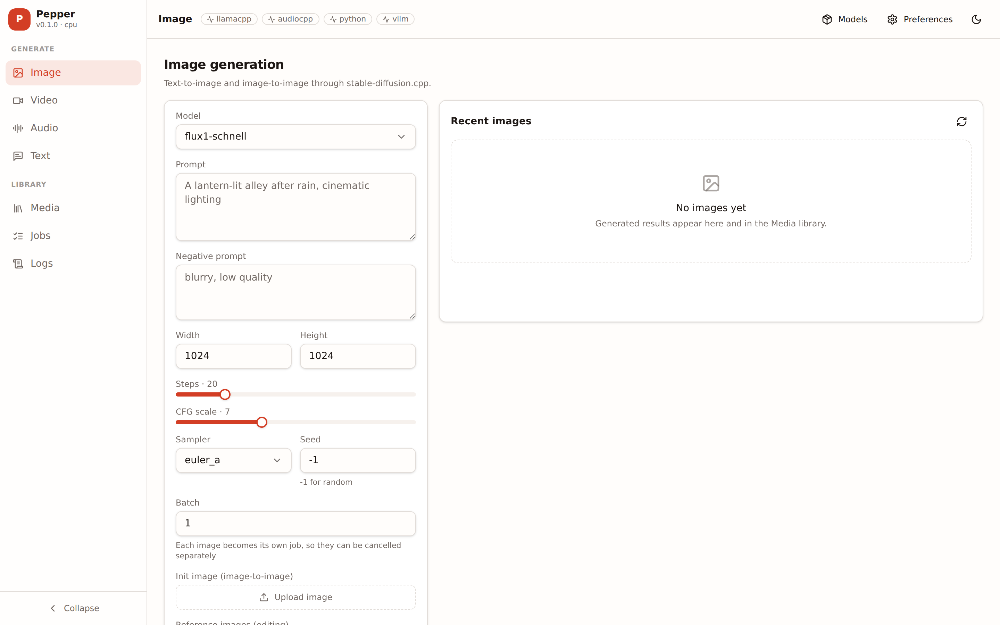
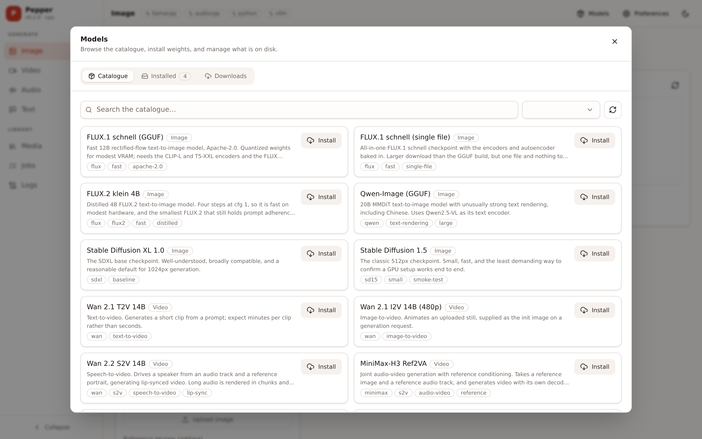
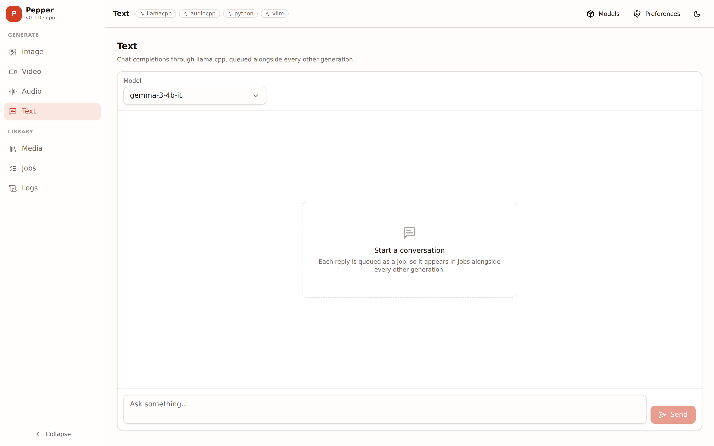

# Pepper

Production media generation API — image, video, audio and text — wrapping
`stable-diffusion.cpp`, `llama.cpp` and `audio.cpp`, with a React SPA served by
the same process.

Pepper is the alpha successor to [sd-api](https://github.com/searpro/sd-api).
It keeps that project's API contract intact and rebuilds what the POC left
unfinished: process supervision, binary installation, a remote model catalogue,
resumable downloads, a persistent job queue and a real UI.



## Screenshots

Running locally with four model bundles installed. No backend binaries are present in these shots,
so nothing is generated — what they show is the console, the queue and the model management around
the generation, which is the part of Pepper that sd-api did not have.

| Model catalogue and installed bundles | Text (chat completions) |
| --- | --- |
|  |  |

The catalogue is a remote manifest rather than code, so adding a model is a pull request against
[searpro/pepper-catalogue](https://github.com/searpro/pepper-catalogue) rather than a Pepper
release — and a model can always be installed by URL when the catalogue is unreachable.

## Quick start

```bash
npm install
npm run build
DATA_DIR=./data npm start           # http://localhost:3000
```

For UI development, run the API and the Vite dev server side by side:

```bash
npm run dev          # API on :3000
npm run dev:web      # SPA on :5173, proxying /v1 to :3000
```

## Configuration

Everything is environment-driven. `DATA_DIR` is the only storage setting that
matters — every persisted path derives from it, so a deployment cannot end up
with models on the volume and binaries on ephemeral disk.

For local development, copy the example env file and edit it:

```bash
cp apps/pepper/server/.env.example apps/pepper/server/.env
```

`apps/pepper/server/.env` is gitignored and loaded automatically by `npm start` and
`npm run dev` — both run with `apps/pepper/server/` as their working directory, which is
where it has to live. Every setting in `.env.example` is commented out and
annotated with its default, so an empty file behaves exactly like no file.

One override is worth knowing about before the first run: `SDCPP_RELEASE_REPO`
and `LLAMACPP_RELEASE_REPO` default to forks that publish only Linux x64 CUDA
builds (made on Ubuntu 22.04, which upstream's llama.cpp builds no longer run
on), so image and text generation have no binary to install on macOS, on
Windows, or on non-CUDA Linux. Point local development at upstream
`leejet/stable-diffusion.cpp` and `ggml-org/llama.cpp`, which build every
platform and acceleration.

| Variable | Default | Purpose |
| --- | --- | --- |
| `DATA_DIR` | `./data` | Binaries, models, uploads and the database. Mount the persistent volume here. |
| `OUTPUT_DIR` | OS temp dir | Generated outputs. Deliberately outside `DATA_DIR` — see below. |
| `OUTPUT_RETENTION_MS` | `86400000` | How long an output survives before the sweep removes it. `0` disables it. |
| `UPSCALE_MODELS_DIR` | `DATA_DIR/models/upscale` | Upscaler checkpoints for Upscale 2×/4×. Install curated ones (UltraSharp, NMKD Siax, ClearReality, RealESRGAN x2plus/x4plus/anime…) from Preferences → Upscalers, or drop any spandrel-loadable `.pth`/`.safetensors` here. The engine (Python/spandrel or sd-cli) and the default per scale are set there too. |
| `PYTHON_EXECUTABLE` | unset | Run Python video jobs (Wan 2.2 5B, LTX-Video, EchoMimicV3) with this interpreter instead of the managed runtime Pepper installs under `DATA_DIR/bin/python`. |
| `BACKEND_IDLE_TIMEOUT` | `300000` | Backends (llama.cpp, audio.cpp, vLLM, Python servers) start on the first job that needs them and stop after this many ms unused. `0` keeps them running. Overridable in Preferences → Backends. |
| `PYTHON_EXCLUSIVE_MEMORY` | `true` | Stop llama.cpp / audio.cpp / vLLM before a Python video job so the model has the memory to itself, and stop llama.cpp after a Character Studio design (the sheet render comes next); they restart on their next request. |
| `HOST` / `PORT` | `0.0.0.0` / `3000` | Public listener. |
| `HTTP_SERVER_TIMEOUT` | `0` | Per-request ceiling. `0` means none, which synchronous generation needs. |
| `ACCEL` | `metal` on macOS, else `cpu` | Selects release assets and backend flags: `cpu`, `cuda`, `metal`, `vulkan`, `rocm`. |
| `AUTO_INSTALL_BACKENDS` | `true` | Install missing backend binaries at startup. |
| `SDCPP_RELEASE_REPO` | `searpro/stable-diffusion.cpp` | Repo whose **latest** release is installed. |
| `LLAMACPP_RELEASE_REPO` | `searpro/llama.cpp` | ditto |
| `AUDIOCPP_RELEASE_REPO` | `searpro/audio.cpp` | ditto |
| `PYTHON_RELEASE_REPO` | `comfyanonymous/ComfyUI` | Experimental Python backend package. |
| `SDCPP_TIMEOUT` | `600000` | Ceiling on one image generation. |
| `SDCPP_VIDEO_TIMEOUT` | `3600000` | Ceiling on one video generation. |
| `AUDIOCPP_TIMEOUT` | `300000` | Ceiling on one proxied audio request. |
| `LLAMACPP_TIMEOUT` | `300000` | Ceiling on one proxied completion. |
| `MAX_CONCURRENT_JOBS` | `1` | Simultaneous generations. Each holds a full model in memory. |
| `MAX_CONCURRENT_DOWNLOADS` | `2` | Simultaneous weight downloads. |
| `CATALOGUE_URL` | `pepper-catalogue.json` on GitHub | The remote model manifest. See `catalogue/`. |
| `FFMPEG_PATH` | `ffmpeg` | Used to slice and stitch speech-to-video runs. Only needed for audio longer than one model window, or non-WAV input. |
| `FFPROBE_PATH` | `ffprobe` | Reads duration for non-WAV audio. Plain WAV is parsed in-process. |
| `HF_TOKEN` | — | HuggingFace token for gated repositories. |
| `LOG_LEVEL` | `info` | `trace` … `fatal`. |

Timeout defaults are sd-api's working values, so a deployment that sets none of
them behaves exactly as the POC did.

### Where outputs live

`OUTPUT_DIR` defaults *outside* `DATA_DIR`. Outputs are the one category that
grows without bound — every image, video and clip ever produced, nearly all
fetched once by the client and never read again — and `DATA_DIR` is a
persistent volume you pay for by the gigabyte-month. The client owns durable
storage; the API serves `/v1/outputs/:name` for as long as a file lives, and
the retention sweep reclaims the rest. Point `OUTPUT_DIR` inside `DATA_DIR` if
you want outputs to survive a restart.

### `DATA_DIR` layout

```
DATA_DIR/
  bin/<backend>/      installed binaries and their sibling shared libraries
  models/<kind>/<bundle>/   weights, one directory per model
  uploads/            init images, masks, reference images, voice clips
  db/pepper.db        SQLite (jobs, downloads, settings)
  cache/              catalogue snapshot, generated backend configs
```

## Models

The model list is a remote manifest, not code: it lives in
[searpro/pepper-catalogue](https://github.com/searpro/pepper-catalogue), so
adding a model is a pull request there rather than a pepper release. Pepper
fetches it at startup with no configuration needed, caches a copy on the data
volume, and falls back to that copy when the fetch fails.

The catalogue currently carries 16 models across image, video, audio and text.
See [`docs/CATALOGUE.md`](docs/CATALOGUE.md) for the schema, and the catalogue
repository's own README for how to add an entry.

Models can also be installed by URL from the Models window, so an unreachable
catalogue is never a hard block.

## Docker / RunPod

```bash
docker build -t pepper .
docker run --gpus all -p 3000:3000 -v pepper-data:/data \
  -e ACCEL=cuda -e HF_TOKEN=hf_... pepper
```

Backend binaries are not baked into the image. They are downloaded on first
boot into `/data/bin`, which is on the volume, so the image stays small and a
backend can be updated without republishing it.

## Kaggle

```bash
uv run deploy/kaggle/launch.py --hours 6
```

Runs the checked-out commit (plus local changes) on a free Kaggle GPU behind a
Cloudflare quick tunnel and prints the public URL. See
[`deploy/kaggle/README.md`](deploy/kaggle/README.md) for prerequisites,
options, and how to stop a run.

## API

OpenAPI lives at `/docs`. The surface is grouped as:

- `/v1/jobs`, `/v1/generate` — image and video generation and the job queue
- `/v1/jobs/audio`, `/v1/jobs/text` — the queued paths for speech and completions
- `/v1/models/:kind/...` — installed bundles
- `/v1/catalogue`, `/v1/downloads` — the remote catalogue and weight downloads
- `/v1/llm/*`, `/v1/audio/*` — OpenAI-shaped text and audio endpoints
- `/v1/outputs`, `/v1/inputs` — media and uploads
- `/v1/backends`, `/v1/config`, `/v1/system/status` — process and configuration
- `/v1/logs`, `/v1/logs/stream` — log query and live tail

All four generation kinds run through one queue, so `MAX_CONCURRENT_JOBS` bounds
every path that loads a model. The OpenAI-shaped endpoints stay synchronous —
they return the audio or the completion inline, and `/v1/llm/*` still streams —
because sd-api clients depend on those shapes. The UI uses the queued paths.

Every sd-api path still works and returns its original response shape; see
[`docs/API-COMPATIBILITY.md`](docs/API-COMPATIBILITY.md).

## Pepper Pro

The repository also holds **Pepper Pro** (`apps/pepper-pro`), the production
product: ComfyUI is its only generative engine, driven through pinned
*recipes* (MiniMax H3, LTX 2.5/2.3, InfiniteTalk, Wan-Animate 2, Wan-Dancer,
Krea 2, Z-Image, Qwen-Image and FLUX.2 edit, SeedVR2, ACE-Step, MiniMax
Music 3), and work is organised as projects: a cast, scenes of shots, takes of
each shot (drafted cheaply, the best finished) and an exported cut with a music
bed, subtitles and social loudness. Claude plans and directs it over MCP.
Both products share `packages/core` and `packages/ui`.

```bash
# ComfyUI at the pinned version, into apps/pepper-pro/server/data/comfy
# (CPU torch is enough to develop against; drop TORCH_INDEX on a CUDA machine):
TORCH_INDEX=https://download.pytorch.org/whl/cpu apps/pepper-pro/server/scripts/install-comfy.sh
npm run dev:pro        # API on :3000
npm run dev:pro-web    # SPA, proxying to PEPPER_API (default :3000)

# On a RunPod GPU (the image is ghcr.io/searpro/pepper-pro):
uv run deploy/runpod/launch.py up --product pro --tier 32gb
```

The design, the recipe format and what has been verified so far are in
[`docs/PEPPER-PRO.md`](docs/PEPPER-PRO.md); the recipes and their licences
in [`apps/pepper-pro/server/recipes/README.md`](apps/pepper-pro/server/recipes/README.md).

## Architecture

See [`docs/ARCHITECTURE.md`](docs/ARCHITECTURE.md) for the design and the
reasoning behind the parts that differ from sd-api, and for how the two
products share a core.

## Development

```bash
npm run typecheck
npm test
```
